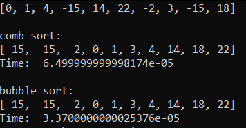
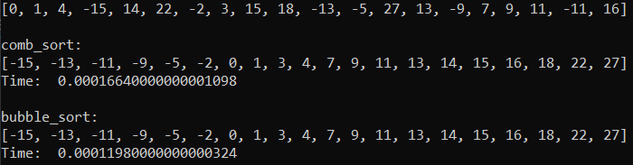

## Comb sort
***
### Программа выполняет следующие задачи:

1. Выполняется запись данных из файла readArr в массив для сортировки
2. Реализуются сортировки Comb sort и bubble sort на одинковых данных,   также происходит подсчет времени сортировки
3. Выполняется запись в файл writeArr.txt

### Время выполнения

В результати работы сортировок, было выяснено, что Comb sort работает быстрее на большем количестве данных   чем bubble sort, когда при сортировке всего 10 элементов, bubble sort показала результаты лучше 

Для n = 10:

Для n = 20:

